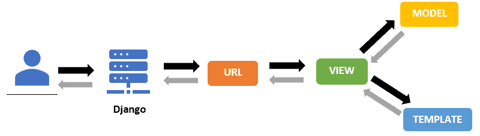

Tautan PWS: https://marco-imanuel-mycleats.pbp.cs.ui.ac.id/
Repo github: https://github.com/aiemusles/mycleats.git

# Soal esai tugas 2

Note: Pengerjaan dilakukan secara terbalik, dari soal terakhir menuju soal pertama.

### 5. Menurut Anda, dari semua framework yang ada, mengapa framework Django dijadikan permulaan pembelajaran pengembangan perangkat lunak?
Dari semua framework yang ada, Django dijadikan permulaan pembelajaran pengembangan perangkat lunak karena tidak hanya framework tersebut menggunakan bahasa pemrograman python yang sudah familiar sejak DDP1, bersifat umum dan memiliki banyak fitur bawaan; tetapi juga karena bahasa python merupakan bahasa dynamic type, sehingga suatu variabel tidak memiliki declared type. Alhasil polymorphism dan generic programming dapat diterapkan secara lebih simpel dan beban mental me-manage tipe data setiap objek dan request yang bermacam-macam jauh lebih kecil. Selain itu, python juga memiliki kemampuan OOP yang mumpuni.

### 2. Buatlah bagan yang berisi request client ke web aplikasi berbasis Django beserta responnya dan jelaskan pada bagan tersebut kaitan antara urls.py, views.py, models.py, dan berkas html.
Migrasi berkerja dengan mengupdate  struktur tabel basis data sesuai dengan perubahan model yang didefinisikan oleh Object Relational Mapping (ORM) suatu model di aplikasi di file models.py yang terlampir. Pada dasarnya, semacam version control untuk skema database aplikasi.

### 3. Jelaskan peran settings.py dalam proyek Django!
Settings.py berperan sebagai file yang mengatur semua konfigurasi suatu proyek django. Konfigurasi tersebut antara lain: debug, direktori dasar proyek, host yang diperbolehkan, aplikasi dalam suatu proyek, database yang digunakan, dan variabel-variabel dan root static.

### 2. Buatlah bagan yang berisi request client ke web aplikasi berbasis Django beserta responnya dan jelaskan pada bagan tersebut kaitan antara urls.py, views.py, models.py, dan berkas html.
Link gambar bagan (referensi: https://www.raystec.com/courses/python/django.html):

Penjelasan:
pertama, user memberikan request url dari browser yang kemudian diterima oleh server django. Kemudian, request url tersebut dicocokan pola URL nya sesuai daftar pola urlpatterns yang diberikan di urls.py sampai berkas urls.py suatu aplikasi atau proyek merefer ke salah satu fungsi atau class di views.py yang mengatur logika presentasi webpage serta mengambil dan memproses data dari models.py dan menunjukkan output nya ke template untuk ditampilkan responsnya kembali ke pengguna.

### 1. Jelaskan bagaimana cara kamu mengimplementasikan checklist di atas secara step-by-step (bukan hanya sekadar mengikuti tutorial).
Langkah-langkahnya sebagai berikut:
    a. Pertama, buat repo github untuk proyek yang bersangkutan.
    b. Clone repo github ke suatu direktori yang dijadikan tempat pengerjaan.
    c. Membuat django project baru untuk tugas yang bersangkutan.
    d. Membuat aplikasi yang bernama main di untuk proyek tersebut.
    e. Membuat models dan mengisinya dengan atribut dan method sesuai dengan kebutuhan aplikasi (Untuk aplikasi ini, class modelnya bernama Cleats).
    f. Melengkapi views.py untuk membuat parameter informasi yang akan ditampilkan di templates
    g. Membuat routing di urls.py aplikasi main untuk memetakan fungsi show_main() pada views.py, serta menambahkan pola URL kosong di urls.py dan memetakannya ke urls.py aplikasi main proyek agar proyek dapat diakses ketika mengetik http://localhost:8000/.
    h. Terkahir, melakukan deployment ke pws terhadap proyek yang sudah dibuat.

