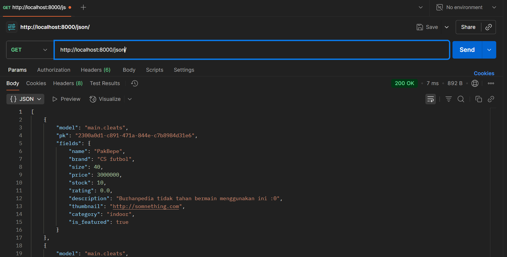

Tautan aplikasi PWS: https://marco-imanuel-mycleats.pbp.cs.ui.ac.id/
Repo github: https://github.com/aiemusles/mycleats.git

# Soal esai tugas 2

Note: Pengerjaan dilakukan secara terbalik, dari soal terakhir menuju soal pertama.

### 5. Menurut Anda, dari semua framework yang ada, mengapa framework Django dijadikan permulaan pembelajaran pengembangan perangkat lunak?
Dari semua framework yang ada, Django dijadikan permulaan pembelajaran pengembangan perangkat lunak karena tidak hanya framework tersebut menggunakan bahasa pemrograman python yang sudah familiar sejak DDP1, bersifat umum dan memiliki banyak fitur bawaan; tetapi juga karena bahasa python merupakan bahasa dynamic type, sehingga suatu variabel tidak memiliki declared type. Alhasil polymorphism dan generic programming dapat diterapkan secara lebih simpel dan beban mental me-manage tipe data setiap objek dan request yang bermacam-macam jauh lebih kecil. Selain itu, python juga memiliki kemampuan OOP yang mumpuni.

### 2. Buatlah bagan yang berisi request client ke web aplikasi berbasis Django beserta responnya dan jelaskan pada bagan tersebut kaitan antara urls.py, views.py, models.py, dan berkas html.
Migrasi berkerja dengan mengupdate  struktur tabel basis data sesuai dengan perubahan model yang didefinisikan oleh Object Relational Mapping (ORM) suatu model di aplikasi di file models.py yang terlampir. Pada dasarnya, semacam version control untuk skema database aplikasi.

### 3. Jelaskan peran settings.py dalam proyek Django!
Settings.py berperan sebagai file yang mengatur semua konfigurasi suatu proyek django. Konfigurasi tersebut antara lain: debug, direktori dasar proyek, host yang diperbolehkan, aplikasi dalam suatu proyek, database yang digunakan, dan variabel-variabel dan root static.

### 2. Buatlah bagan yang berisi request client ke web aplikasi berbasis Django beserta responnya dan jelaskan pada bagan tersebut kaitan antara urls.py, views.py, models.py, dan berkas html.
Link gambar bagan (referensi: https://www.raystec.com/courses/python/django.html):

Penjelasan:
pertama, user memberikan request url dari browser yang kemudian diterima oleh server django. Kemudian, request url tersebut dicocokan pola URL nya sesuai daftar pola urlpatterns yang diberikan di urls.py sampai berkas urls.py suatu aplikasi atau proyek merefer ke salah satu fungsi atau class di views.py yang mengatur logika presentasi webpage serta mengambil dan memproses data dari models.py dan menunjukkan output nya ke template untuk ditampilkan responsnya kembali ke pengguna.

### 1. Jelaskan bagaimana cara kamu mengimplementasikan checklist di atas secara step-by-step (bukan hanya sekadar mengikuti tutorial).
Langkah-langkahnya sebagai berikut:
    a. Pertama, buat repo github untuk proyek yang bersangkutan.
    b. Clone repo github ke suatu direktori yang dijadikan tempat pengerjaan.
    c. Membuat django project baru untuk tugas yang bersangkutan.
    d. Membuat aplikasi yang bernama main di untuk proyek tersebut.
    e. Membuat models dan mengisinya dengan atribut dan method sesuai dengan kebutuhan aplikasi (Untuk aplikasi ini, class modelnya bernama Cleats).
    f. Melengkapi views.py untuk membuat parameter informasi yang akan ditampilkan di templates
    g. Membuat routing di urls.py aplikasi main untuk memetakan fungsi show_main() pada views.py, serta menambahkan pola URL kosong di urls.py dan memetakannya ke urls.py aplikasi main proyek agar proyek dapat diakses ketika mengetik http://localhost:8000/.
    h. Terakhir, melakukan deployment ke pws terhadap proyek yang sudah dibuat.

# Soal esai tugas 3

### 1. Jelaskan mengapa kita memerlukan data delivery dalam pengimplementasian sebuah platform?
Kita memerlukan data delivery dalam pengimplementasian sebuah platform karena agar suatu platform dapat bersifat interaktif dengan pengguna, suatu platform harus memiliki cara untuk menerima suatu data respons/request dari pengguna terlebih dahulu, sebelum dapat disimpan dan/atau diproses melalui logika untuk menghasilkan suatu respons kembali ke user (Hal ini pun juga membutuhkan suatu mekanisme penyaluran data/data delivery).

### 2. Menurutmu, mana yang lebih baik antara XML dan JSON? Mengapa JSON lebih populer dibandingkan XML?
Menurutku, JSON lebih baik karena bagiku presentasi data suatu model dengan JSON terkesan lebih rapih dan terstruktur ketimbang dengan XML yang terkesan lebih bertele-tele dan susah dibaca formatnya, terutama jika objek yang dimiliki suatu proyek banyak. Hal ini ditambah dengan kompatibilitas JSON yang tinggi dengan Javascript - *de facto lingua franca* pengembangan web - membuat JSON lebih populer dari XML sebagai format representasi basis data.

### 3. Jelaskan fungsi dari method is_valid() pada form Django dan mengapa kita membutuhkan method tersebut?
Fungsi dari method tersebut adalah untuk mengecek apakah data yang dimasukkan dalam suatu form bersifat valid atau tidak. Kita membutuhkan method tersebut karena selain untuk menerima data, form/formulir berguna juga sebagai validator data. Dan bila terdapat objek yang dibuat dengan data yang tidak valid, maka hal ini dapat berdampak dengan interaksi terhadap logika dan objek-objek lainnya secara negatif.

### 4. Mengapa kita membutuhkan csrf_token saat membuat form di Django? Apa yang dapat terjadi jika kita tidak menambahkan csrf_token pada form Django? Bagaimana hal tersebut dapat dimanfaatkan oleh penyerang?
Kita membutuhkan csrf_token saat membuat form di Django untuk mencegah serangan CSRF (Cross Site Request Forgery) - serangan yang membuat end user terpaksa melakukan tindakan yang tidak diinginkan melalui link yang mencurigakan. csrf_token berguna nilai yang digunakan untuk verifikasi apakah request link yang diberikan bersifat valid. Tanpa adanya csrf_token untuk memverifikasi suatu hyperlink, maka penyerang dapat memasukkan suatu link mencurigakan yang diberi nama domain dan pola URL yang terlihat meyakinkan terhadapa pengguna tanpa masalah apapun, dan suatu user dapat meng-klik link tersebut dan terjerat dalam serangan CSRF penyerang.

### 5. Jelaskan bagaimana cara kamu mengimplementasikan checklist di atas secara step-by-step (bukan hanya sekadar mengikuti tutorial).
Langkah-langkahnya sebagai berikut:
    (Sebelumnya, ditambahkan field id untuk keperluan pencarian objek di model, lalu basis data yang baru dimigrasikan dulu)
    a. Membuat halaman form untuk menambahkan objek ke aplikasi dengan field2 tertentu yang diberikan pengguna
    b. Menambah dua fungsi view baru: Satu untuk menambah objek, satu untuk deskripsi terperinci suatu objek; lalu menambahkan dua template html baru untuk tiap fungsi view tersebut.
    c. Menambah tombol dan daftar produk di main.html dan menghubungkan tiap tombol tersebut ke link fungsi view yang sesuai dengan reverse url.
    d. Menambahkan fungsi view untuk mengembalikan data dalam bentuk XML dan JSON (baik dengan ID maupun secara umum) dan routing url untuk fungsi yang korespon.
    e. Mengecek hasil program secara manual dengan mengaktifkan server lokal dan memasukkan link website di localhost
    f. Terkahir, melakukan deployment ke pws terhadap proyek yang sudah dibuat.

### SS akses URL dengan postman:
- 
- 
- 
- 

